# BGA - Simulations

Archive of the simulations used on the Beginner's Guide to Aeronautics website (https://www.grc.nasa.gov/WWW/K-12/airplane/). Contains both the
Javascript and Applet versions. 

## Applet Testing
Spreadsheet with applet status and testing notes: [here](https://teams.microsoft.com/l/file/1BDB9782-FB06-4513-BBD2-CAF5352E593F?tenantId=7005d458-45be-48ae-8140-d43da96dd17b&fileType=xlsx&objectUrl=https%3A%2F%2Fnasa.sharepoint.com%2Fteams%2FGlennWebImprovementProjectGWIP%2FShared%20Documents%2FSite%20Migration%20Documents%2FBGA%20Sites%2FCheerpJ%2FConverted%20Applet%20Testing.xlsx&baseUrl=https%3A%2F%2Fnasa.sharepoint.com%2Fteams%2FGlennWebImprovementProjectGWIP&serviceName=teams&threadId=19:8cf1bd240ad14ca280afb30e64eac005@thread.skype&groupId=5980ac87-3827-4968-8a8e-82946d894e92)

## Simulation List

**Name**: 1900  Aircraft Interactive  
**Applet**: 1900.zip  
**Shortcode**: [bga_simulation name="1900"]   
**Example**: TBD  
**Status**: Phase 1 testing complete      
**Instructions**: [1900 Aircraft Wiki](https://gitlab.grc.nasa.gov/gwip/bga-applet-archive/-/wikis/1900%20Aircraft%20Interactive)

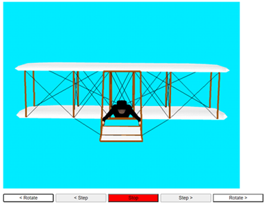

---
**Name**: 1901  Aircraft Interactive  
**Applet**: 1901.zip  
**Shortcode**: TBD  
**Example**: TBD  
**Status**: Phase 1 testing complete     
**Instructions**: [1901 Aircraft Wiki](https://gitlab.grc.nasa.gov/gwip/bga-applet-archive/-/wikis/1901%20Aircraft%20Interactive)

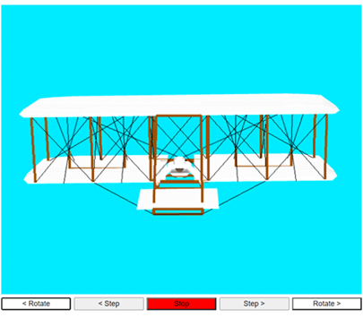

---
**Name**: 1902  Aircraft Interactive  
**Applet**: 1902.zip  
**Shortcode**: TBD  
**Example**: TBD  
**Status**: Phase 1 testing complete      
**Instructions**: [1902 Aircraft Wiki](https://gitlab.grc.nasa.gov/gwip/bga-applet-archive/-/wikis/1902%20Aircraft%20Interactive)    

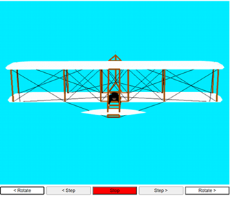

---
**Name**: 1903  Aircraft Interactive  
**Applet**: 1903.zip  
**Shortcode**: TBD  
**Example**: TBD  
**Status**: Phase 1 testing complete      
**Instructions**: [1903 Aircraft Wiki](https://gitlab.grc.nasa.gov/gwip/bga-applet-archive/-/wikis/1903%20Aircraft%20Interactive)

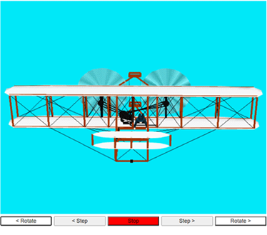

---
**Name**: 1904  Aircraft Interactive  
**Applet**: 1904.zip  
**Shortcode**: TBD  
**Example**: TBD  
**Status**: Phase 1 testing complete     
**Instructions**: [1904 Aircraft Wiki](https://gitlab.grc.nasa.gov/gwip/bga-applet-archive/-/wikis/1904%20Aircraft%20Interactive)

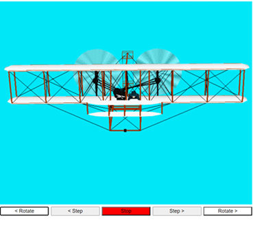

---
**Name**: 1905  Aircraft Interactive  
**Applet**: 1905.zip  
**Shortcode**: TBD  
**Example**: TBD  
**Status**: Phase 1 testing complete     
**Instructions**: [1905 Aircraft Wiki](https://gitlab.grc.nasa.gov/gwip/bga-applet-archive/-/wikis/1905%20Aircraft%20Interactive)

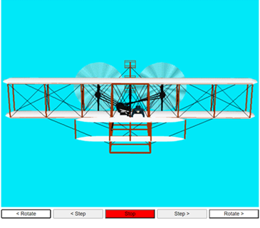

---
**Name**: Atmos  
**Applet**: Atmos.zip  
**Shortcode**: TBD  
**Example**: TBD  
**Status**: Phase 1 testing complete     
**Instructions**: [Atmospheric Factors Wiki](https://gitlab.grc.nasa.gov/gwip/bga-applet-archive/-/wikis/Atmospheric%20and%20Aerodynamic%20Factors)  

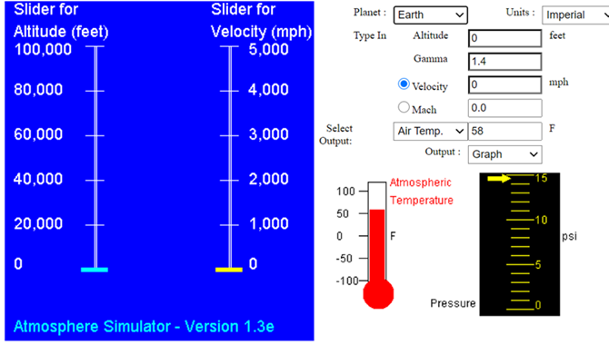

---
**Name**: Ball Kiosk  
**Applet**: Ball Kiosk.zip  
**Shortcode**: TBD  
**Example**: TBD  
**Status**: Phase 1 testing complete      
**Instructions**: [Curveball Wiki](https://gitlab.grc.nasa.gov/gwip/bga-applet-archive/-/wikis/Curveball)

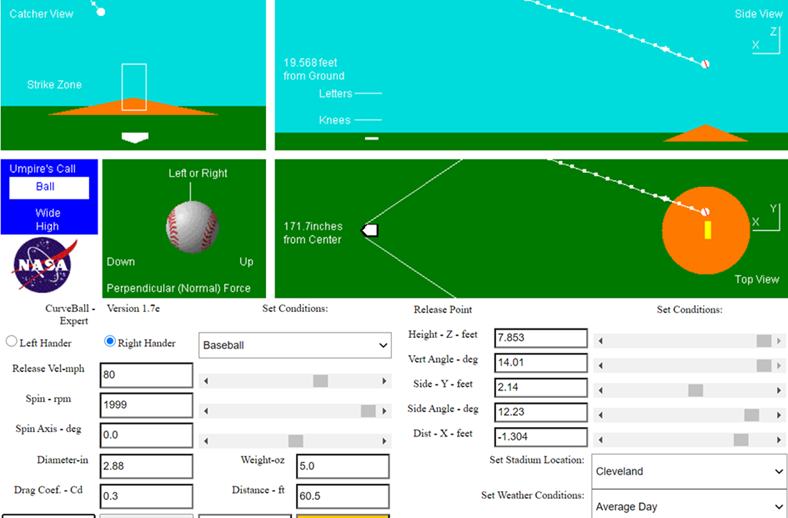

---
**Name**: CMFlow  
**Applet**: CMFlow.zip  
**Shortcode**: TBD  
**Example**: TBD  
**Status**: Phase 1 testing complete    
**Instructions**: [Compressible Mass Flow Rate Wiki](https://gitlab.grc.nasa.gov/gwip/bga-applet-archive/-/wikis/Compressible%20Mass%20Flow%20Rate%20Interactive)

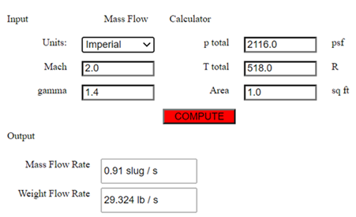

---
**Name**: Design  
**Applet**: Design.zip  
**Shortcode**: TBD  
**Example**: TBD  
**Status**: Phase 1 testing complete      
**Instructions**: 

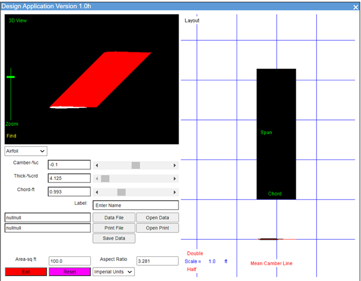

---
**Name**: Drop  
**Applet**: Drop.zip  
**Shortcode**: [bga_simulation name="Drop"]  
**Example**: TBD  
**Status**: Phase 1 testing complete    
**Instructions**: [DropSim Wiki](https://gitlab.grc.nasa.gov/gwip/bga-applet-archive/-/wikis/DropSim%20Interactive%20Simulator)

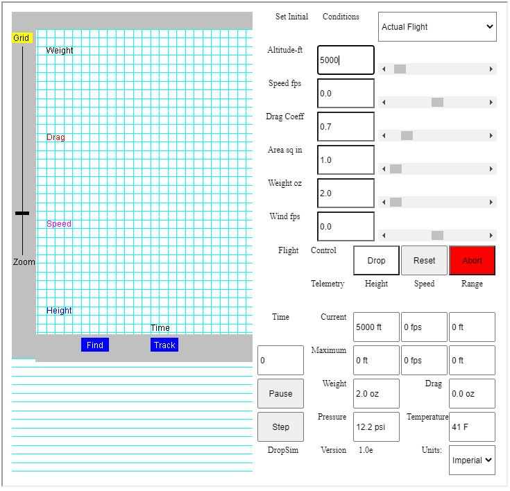

---
**Name**: Engine  
**Applet**: Engine.zip  
**Shortcode**: [bga_simulation name="Engine"]  
**Example**: TBD  
**Status**: Phase 1 testing complete      
**Instructions**: [Engine Wiki](https://gitlab.grc.nasa.gov/gwip/bga-applet-archive/-/wikis/Engine%20Interactive)

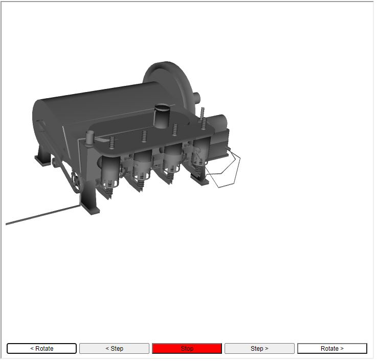

---
**Name**: EngineSim  
**Applet**: EngineSim.zip  
**Shortcode**: [bga_simulation name="EngineSim"]  
**Example**: TBD  
**Status**: Phase 1 testing complete     
**Instructions**: [Engine Parameters Wiki](https://gitlab.grc.nasa.gov/gwip/bga-applet-archive/-/wikis/Engine%20Parameters%20Interactive)

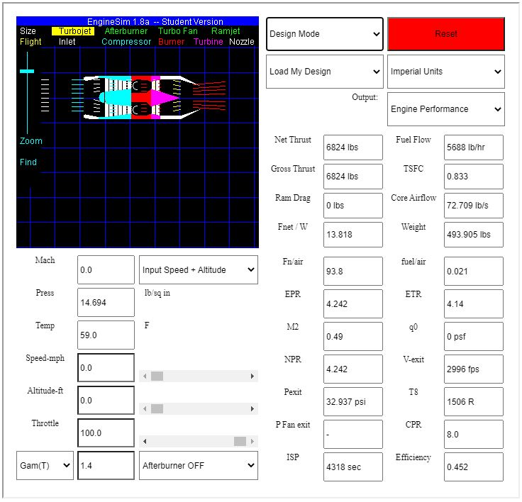

---
**Name**: EngineSimR  
**Applet**: EngineSimR.zip  
**Shortcode**: [bga_simulation name="EngineSimR"]  
**Example**: TBD  
**Status**: Phase 1 testing complete      
**Instructions**: [Range Games Wiki](https://gitlab.grc.nasa.gov/gwip/bga-applet-archive/-/wikis/Range%20Games%20Interactive%20Simulator)

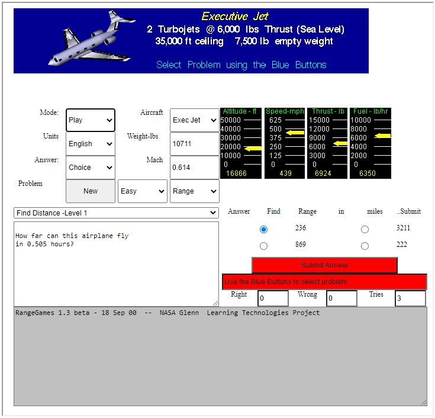

---
**Name**: EngineSimU  
**Applet**: EngineSimU.zip  
**Shortcode**: [bga_simulation name="EngineSimU"]  
**Example**: TBD  
**Status**: Phase 1 testing complete    
**Instructions**: [Jet Engine Wiki](https://gitlab.grc.nasa.gov/gwip/bga-applet-archive/-/wikis/Jet%20Engine%20Interactive%20Simulator)

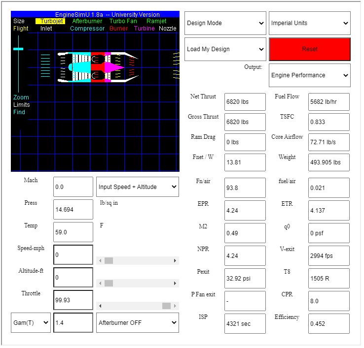

---
**Name**: Flaps  
**Applet**: Flaps.zip  
**Shortcode**: [bga_simulation name="Flaps"]  
**Example**: TBD  
**Status**: Phase 1 testing complete

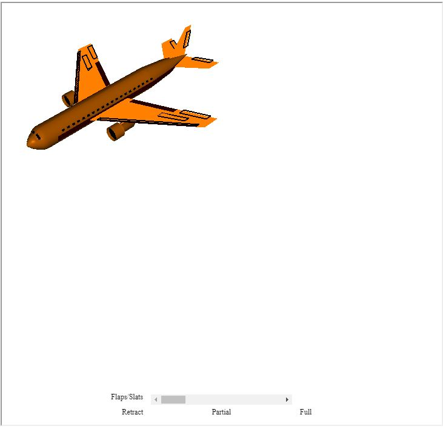

---
**Name**: Fltcalc  
**Applet**: Fltcalc.zip  
**Shortcode**: [bga_simulation name="Fltcalc"]  
**Example**: TBD  
**Status**: Phase 1 testing complete     
**Instructions**: [Ballistic Flight Calculator Wiki](https://gitlab.grc.nasa.gov/gwip/bga-applet-archive/-/wikis/Ballistic%20Flight%20Calculator)

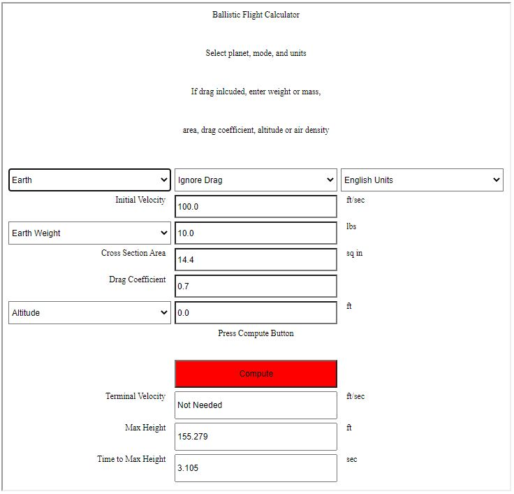

---
**Name**: FoilObj  
**Applet**: FoilObj.zip  
**Shortcode**: [bga_simulation name="FoilObj"]  
**Example**: TBD  
**Status**: Phase 1 testing complete

---
**Name**: FoilShape  
**Applet**: FoilShape.zip  
**Shortcode**: [bga_simulation name="FoilShape"]  
**Example**: TBD  
**Status**: Phase 1 testing complete

---
**Name**: FoilSim  
**Applet**: FoilSim.zip  
**Shortcode**: [bga_simulation name="FoilSim"]  
**Example**: TBD  
**Status**: Phase 1 testing complete

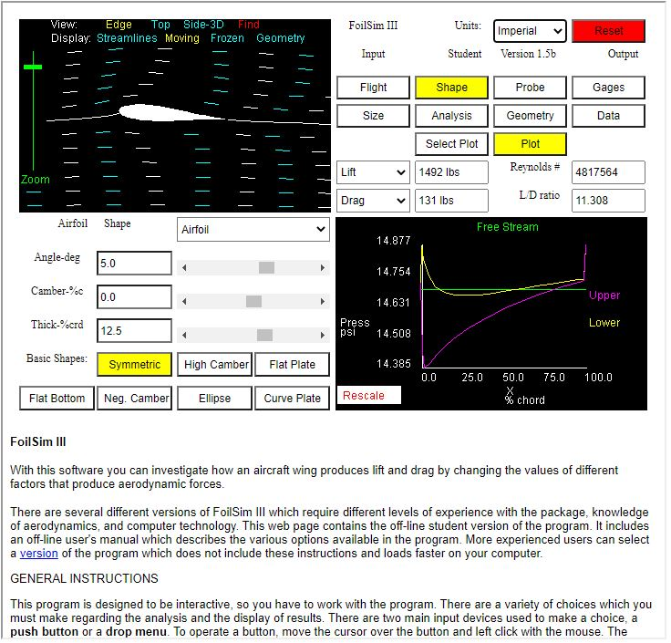

---
**Name**: FoilSimb  
**Applet**: FoilSimb.zip  
**Shortcode**: [bga_simulation name="FoilSimb"]  
**Example**: TBD  
**Status**: Phase 1 testing complete

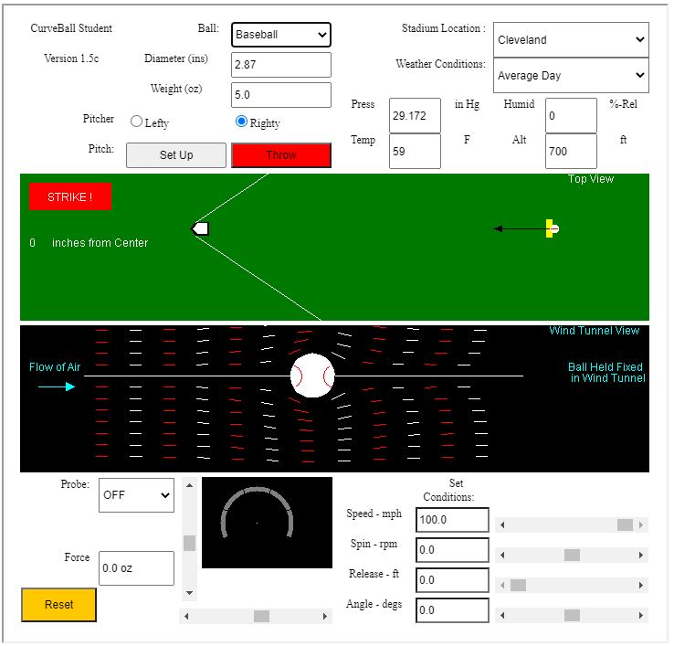

---
**Name**: FoilSimElementary  
**Applet**: FoilSimElementary.zip  
**Shortcode**: [bga_simulation name="FoilSimElementary"]  
**Example**: TBD  
**Status**: Phase 1 testing complete    
**Instructions**: [Elementary Airfoil Wiki](https://gitlab.grc.nasa.gov/gwip/bga-applet-archive/-/wikis/Elementary%20Airfoil%20Interactive)

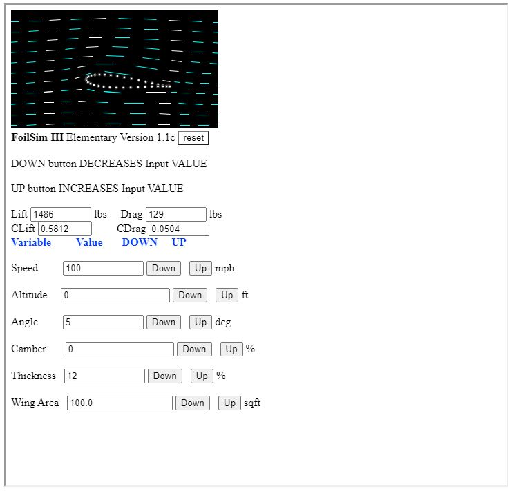

---
**Name**: FoilSize  
**Applet**: FoilSize.zip  
**Shortcode**: [bga_simulation name="FoilSize"]  
**Example**: TBD  
**Status**: Phase 1 testing complete

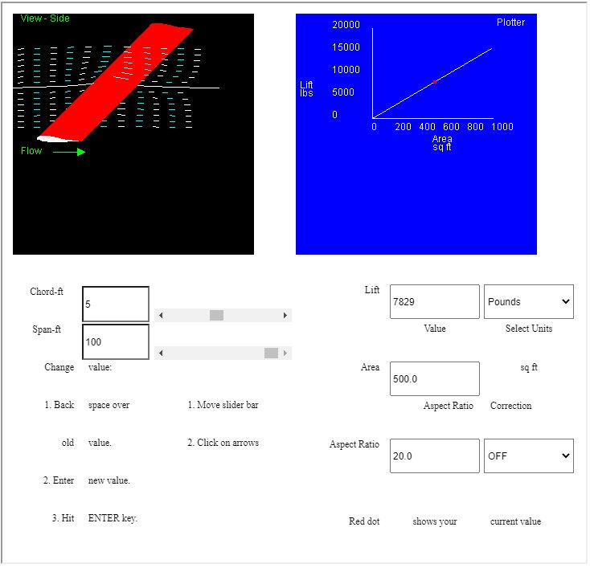

---
**Name**: FoilSimStudent  
**Applet**: FoilSimStudent.zip  
**Shortcode**: [bga_simulation name="FoilSimStudent"]  
**Example**: TBD  
**Status**: Phase 1 testing complete    
**Instructions**: [Student Airfoil Wiki](https://gitlab.grc.nasa.gov/gwip/bga-applet-archive/-/wikis/Student%20Airfoil)

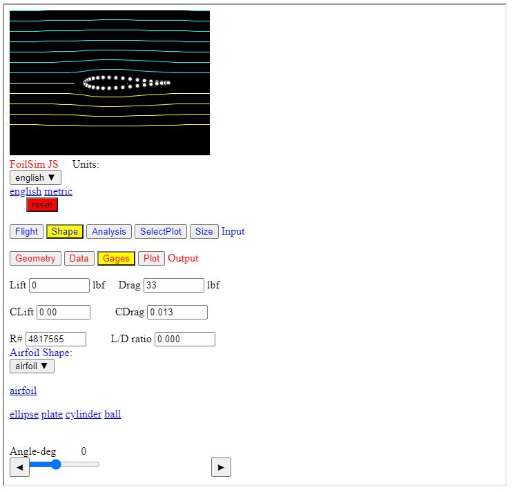

---
**Name**: FoilSimUA  
**Applet**: FoilSimUA.zip  
**Shortcode**: [bga_simulation name="FoilSimUA"]  
**Example**: TBD  
**Status**: Phase 1 testing complete

---
**Name**: FoilSimU  
**Applet**: FoilSimU.zip  
**Shortcode**: [bga_simulation name="FoilSimU"]  
**Example**: TBD  
**Status**: Phase 1 testing complete    
**Instructions**: [Foil Sim U Wiki](https://gitlab.grc.nasa.gov/gwip/bga-applet-archive/-/wikis/Aircraft-Force-Interactive-(FoilSim-3-University))

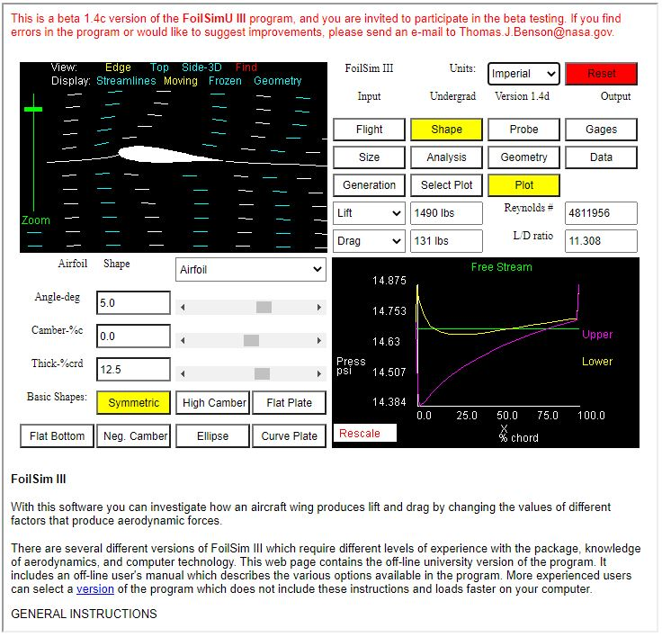

---
**Name**: FoilB  
**Applet**: FoilB.zip  
**Shortcode**: [bga_simulation name="FoilB"]  
**Example**: TBD  
**Status**: Phase 1 testing complete     
**Instructions**: [Ideal Lift of Spinning Ball Wiki](https://gitlab.grc.nasa.gov/gwip/bga-applet-archive/-/wikis/Ideal%20Lift%20of%20Spinning%20Ball%20Interactive)

---
**Name**: FoilCyl  
**Applet**: FoilCyl.zip  
**Shortcode**: [bga_simulation name="FoilCyl"]  
**Example**: TBD  
**Status**: Phase 1 testing complete    
**Instructions**: [Lift of Rotating Cylinder Wiki](https://gitlab.grc.nasa.gov/gwip/bga-applet-archive/-/wikis/Lift%20of%20Rotating%20Cylinder%20Calculator)

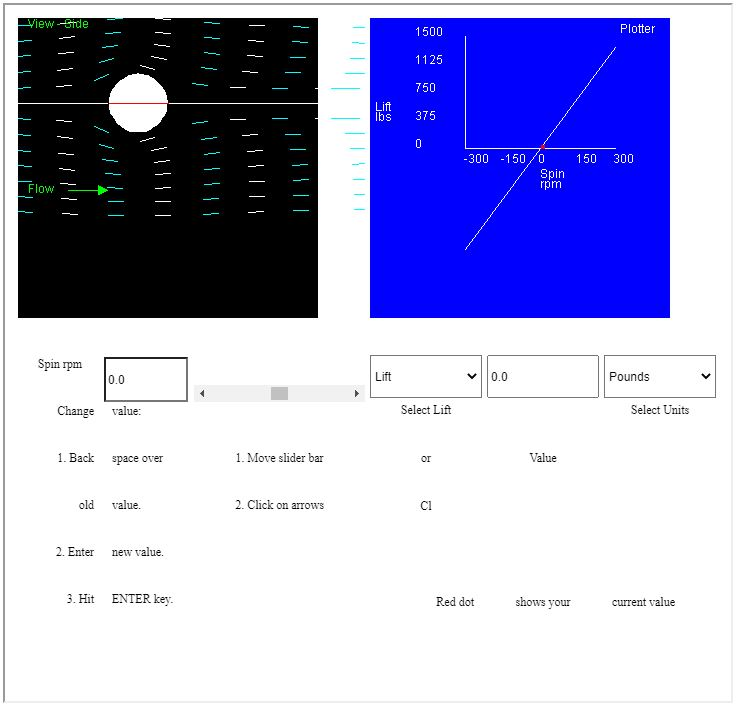

---
**Name**: FoilDen  
**Applet**: FoilDen.zip  
**Shortcode**: [bga_simulation name="FoilDen"]  
**Example**: TBD  
**Status**: Phase 1 testing complete

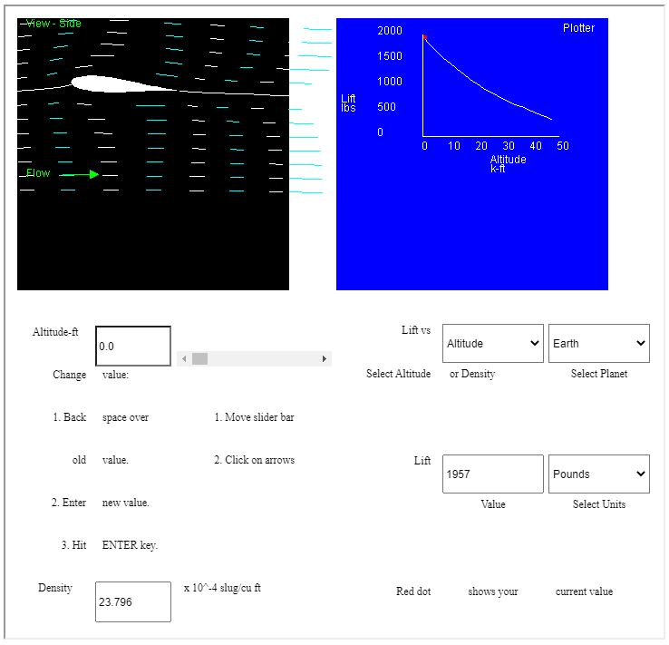

---
**Name**: FoilInc  
**Applet**: FoilInc.zip  
**Shortcode**: [bga_simulation name="FoilInc"]  
**Example**: TBD  
**Status**: Phase 1 testing complete    
**Instructions**: [Effects of Inclination Wiki](https://gitlab.grc.nasa.gov/gwip/bga-applet-archive/-/wikis/Effects%20of%20Inclination%20on%20Lift%20Interactive)

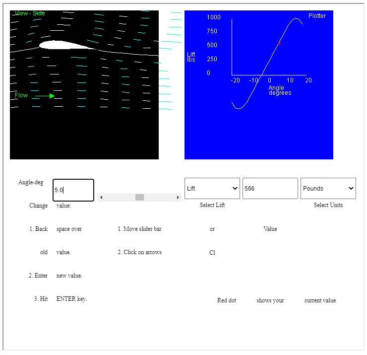

---
**Name**: FoilTrn  
**Applet**: FoilTrn.zip  
**Shortcode**: [bga_simulation name="FoilTrn"]  
**Example**: TBD  
**Status**: Phase 1 testing complete

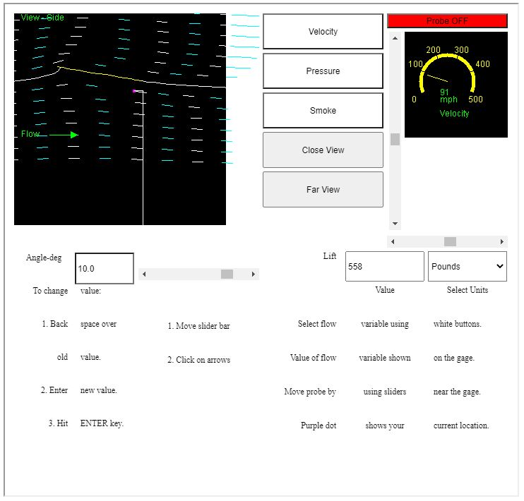

---
**Name**: FoilVel  
**Applet**: FoilVel.zip  
**Shortcode**: [bga_simulation name="FoilVel"]  
**Example**: TBD  
**Status**: Phase 1 testing complete    
**Instructions**: [Effects of Velocity Wiki](https://gitlab.grc.nasa.gov/gwip/bga-applet-archive/-/wikis/Effects%20of%20Velocity%20on%20Lift%20Interactive)

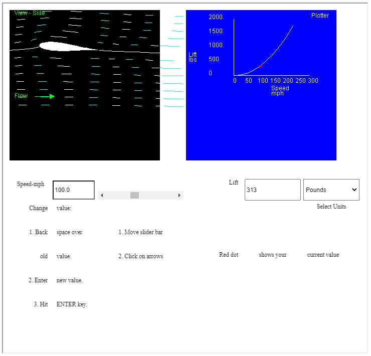

---
**Name**: FoilW1  
**Applet**: FoilW1.zip  
**Shortcode**: [bga_simulation name="FoilW1"]  
**Example**: TBD  
**Status**: Phase 1 testing complete

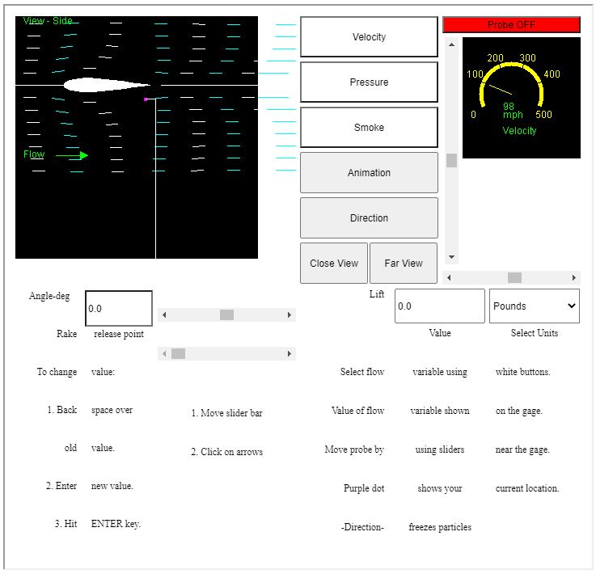

---
**Name**: FoilW2  
**Applet**: FoilW2.zip  
**Shortcode**: [bga_simulation name="FoilW2"]  
**Example**: TBD  
**Status**: Phase 1 testing complete

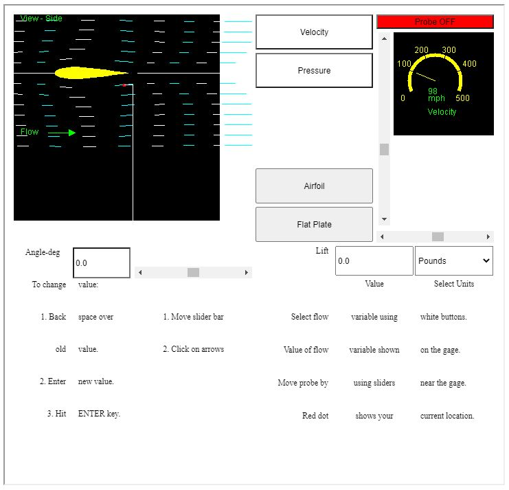

---
**Name**: Geom  
**Applet**: Geom.zip  
**Shortcode**: [bga_simulation name="Geom"]  
**Example**: TBD  
**Status**: Phase 1 testing complete    
**Instructions**: [Wing Geometry Wiki](https://gitlab.grc.nasa.gov/gwip/bga-applet-archive/-/wikis/Wing%20Geometry%20Definition%20Interactive)

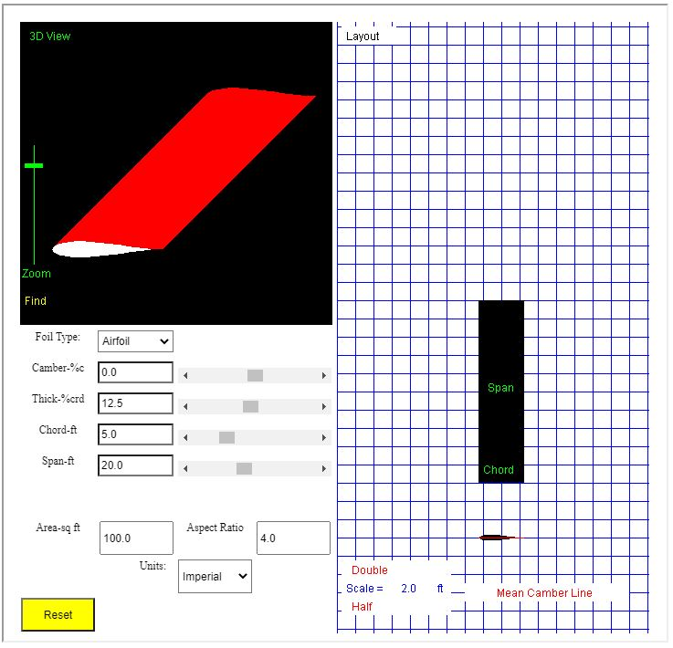

---
**Name**: Gimbal  
**Applet**: Gimbal.zip  
**Shortcode**: [bga_simulation name="Gimbal"]  
**Example**: TBD  
**Status**: Phase 1 testing complete    
**Instructions**: [Gimbaled Thrust Wiki](https://gitlab.grc.nasa.gov/gwip/bga-applet-archive/-/wikis/Gimbaled%20Thrust%20Animated%20Interactive)

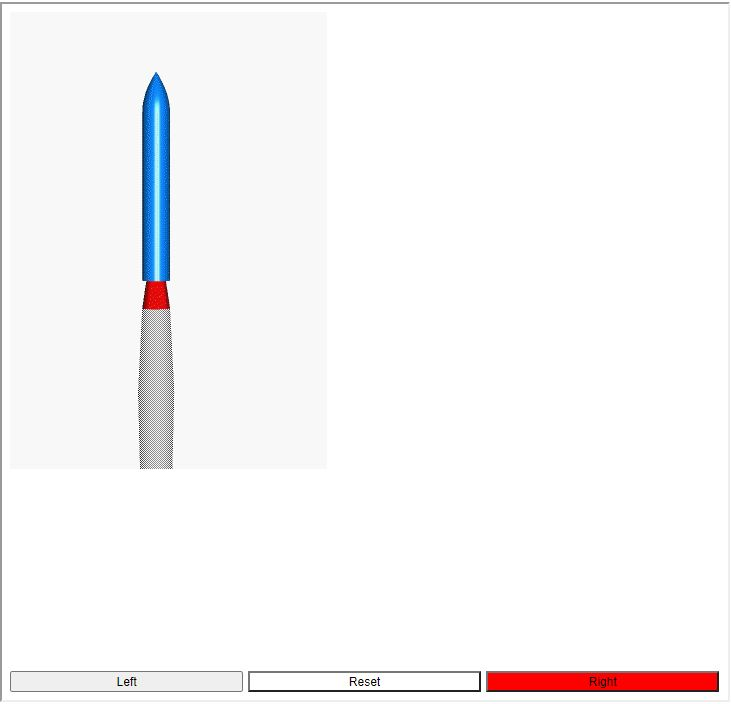

---
**Name**: HitKiosk  
**Applet**: HitKiosk.zip  
**Shortcode**: [bga_simulation name="HitKiosk"]  
**Example**: TBD  
**Status**: Phase 1 testing complete     
**Instructions**: [Hit Kiosk Wiki](https://gitlab.grc.nasa.gov/gwip/bga-applet-archive/-/wikis/Hit%20Kiosk%20Interactive%20Simulator)

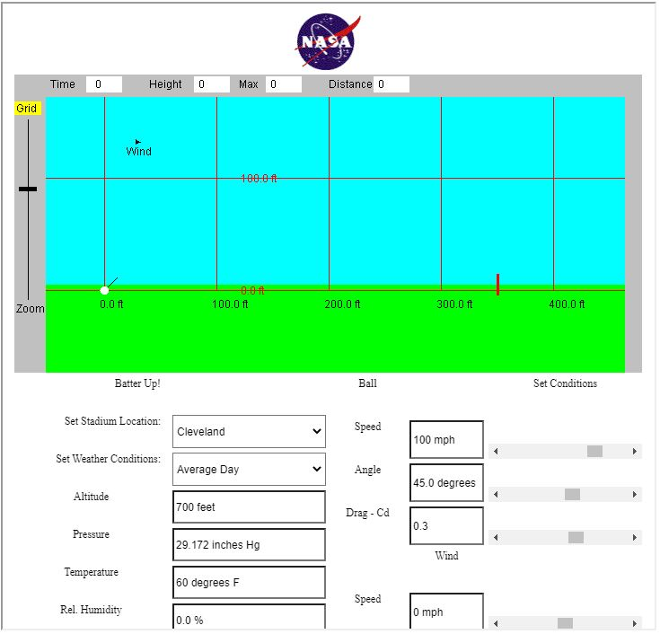

---
**Name**: Hit  
**Applet**: Hit.zip  
**Shortcode**: [bga_simulation name="Hit"]  
**Example**: TBD  
**Status**: Phase 1 testing complete     
**Instructions**: [Hit Modeler Wiki](https://gitlab.grc.nasa.gov/gwip/bga-applet-archive/-/wikis/Hit%20Modeler%20Interactive)

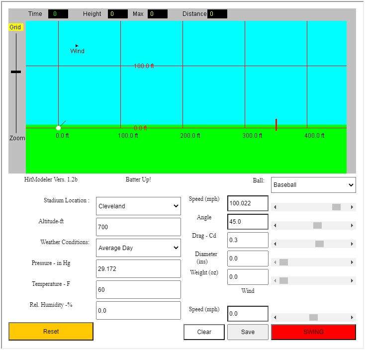

---
**Name**: Incline  
**Applet**: Incline.zip  
**Shortcode**: [bga_simulation name="Incline"]  
**Example**: TBD  
**Status**: Phase 1 testing complete
**Instructions**: []

---
**Name**: Isentrop  
**Applet**: Isentrop.zip  
**Shortcode**: [bga_simulation name="Isentrop"]  
**Example**: TBD  
**Status**: Phase 1 testing complete     
**Instructions**: [Isentropic Force Wiki](https://gitlab.grc.nasa.gov/gwip/bga-applet-archive/-/wikis/Interactive%20Isentropic%20Force)

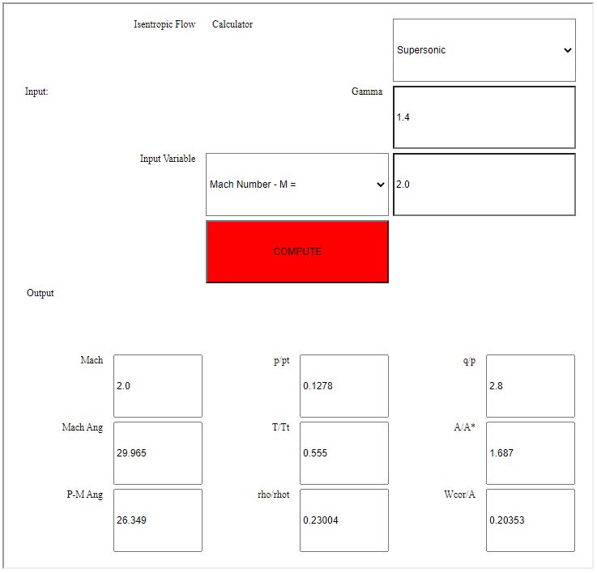

---
**Name**: KiteModeler  
**Applet**: KiteModeler.zip  
**Shortcode**: [bga_simulation name="KiteModeler"]  
**Example**: TBD  
**Status**: Phase 1 testing complete     
**Instructions**: [Kite Modeler Wiki](https://gitlab.grc.nasa.gov/gwip/bga-applet-archive/-/wikis/Kite%20Modeler%20Interactive)

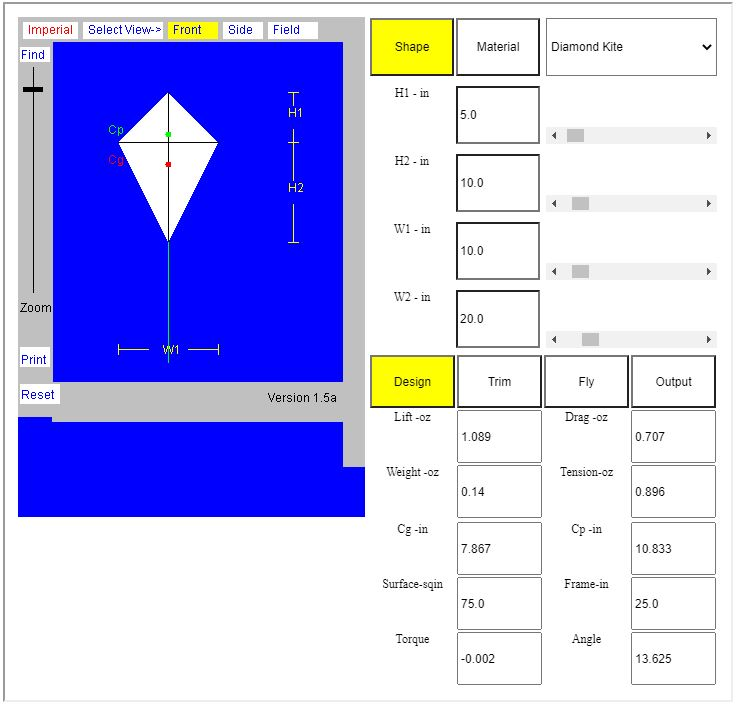

---
**Name**: Mocprog  
**Applet**: Mocprog.zip  
**Shortcode**: [bga_simulation name="Mocprog"]  
**Example**: TBD  
**Status**: Phase 1 testing complete

---
**Name**: Mshock  
**Applet**: Mshock.zip  
**Shortcode**: [bga_simulation name="Mshock"]  
**Example**: TBD  
**Status**: Phase 1 testing complete

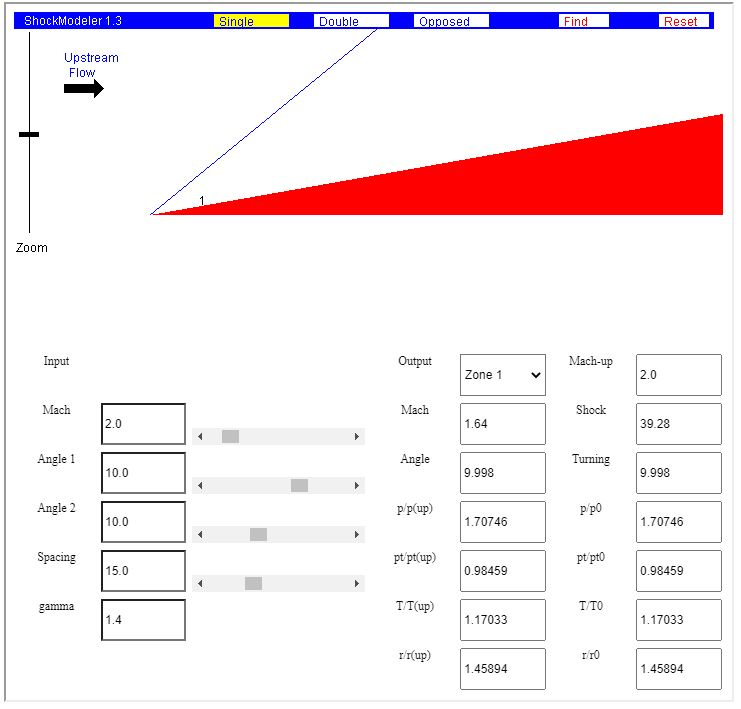

---
**Name**: Mshockprog  
**Applet**: Mshockprog.zip  
**Shortcode**: [bga_simulation name="Mshockprog"]  
**Example**: TBD  
**Status**: Phase 1 testing complete

---
**Name**: Nozzle  
**Applet**: Nozzle.zip  
**Shortcode**: [bga_simulation name="Nozzle"]  
**Example**: TBD  
**Status**: Phase 1 testing complete     
**Instructions**: [Nozzle Wiki](https://gitlab.grc.nasa.gov/gwip/bga-applet-archive/-/wikis/Nozzle%20Interactive)

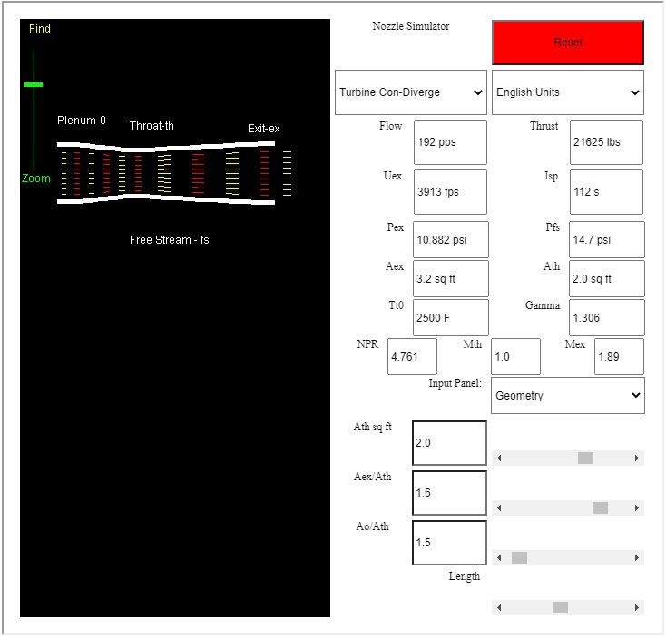

---
**Name**: Normal  
**Applet**: Normal.zip  
**Shortcode**: [bga_simulation name="Normal"]  
**Example**: TBD  
**Status**: Phase 1 testing complete     
**Instructions**: [Normal Shock Calculator Wiki](https://gitlab.grc.nasa.gov/gwip/bga-applet-archive/-/wikis/Normal-Shocks-Calculator)

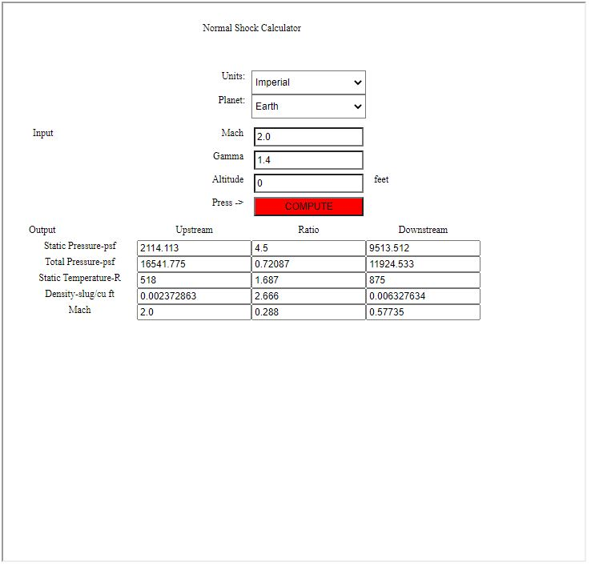

---
**Name**: Pitch  
**Applet**: Pitch.zip  
**Shortcode**: [bga_simulation name="Pitch"]  
**Example**: TBD  
**Status**: Phase 1 testing complete      
**Instructions**: [Pitch Wiki](https://gitlab.grc.nasa.gov/gwip/bga-applet-archive/-/wikis/Pitch%20Interactive)

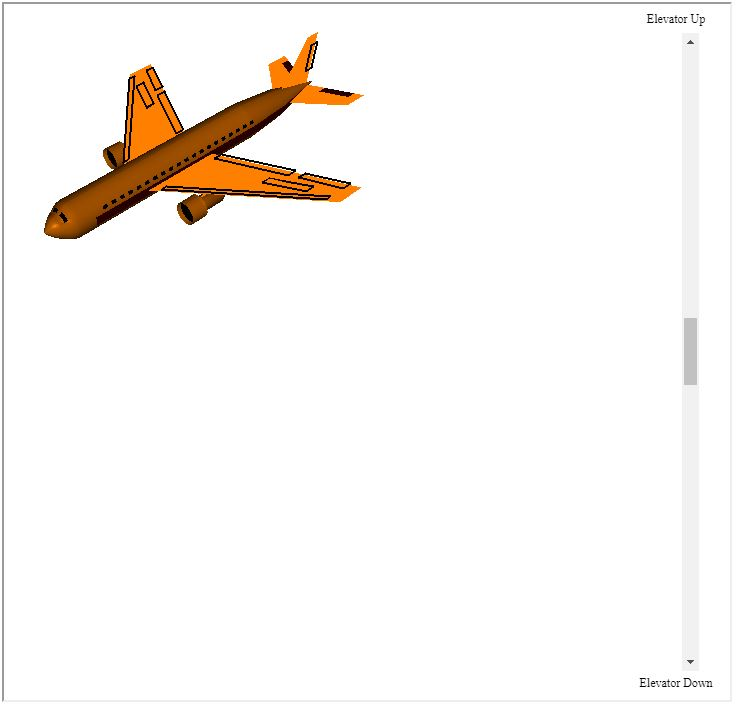

---
**Name**: Process  
**Applet**: Process.zip  
**Shortcode**: [bga_simulation name="Process"]  
**Example**: TBD  
**Status**: Phase 1 testing complete
**Instructions**: [Wind Tunnel Wing Test Wiki](https://gitlab.grc.nasa.gov/gwip/bga-applet-archive/-/wikis/Wind%20Tunnel%20Wing%20Test%20Interactive)

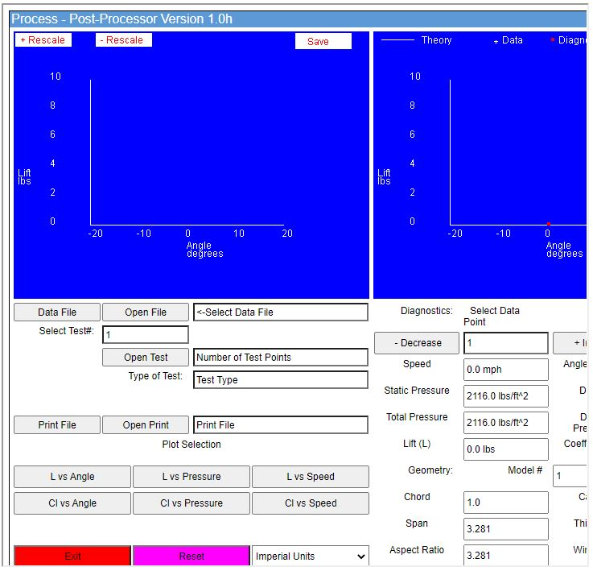

---
**Name**: Rnoz  
**Applet**: Rnoz.zip  
**Shortcode**: [bga_simulation name="Rnoz"]  
**Example**: TBD  
**Status**: Phase 1 testing complete     
**Instructions**: [Rocket Nozzle Wiki](https://gitlab.grc.nasa.gov/gwip/bga-applet-archive/-/wikis/Rocket%20Nozzle%20Interactive)

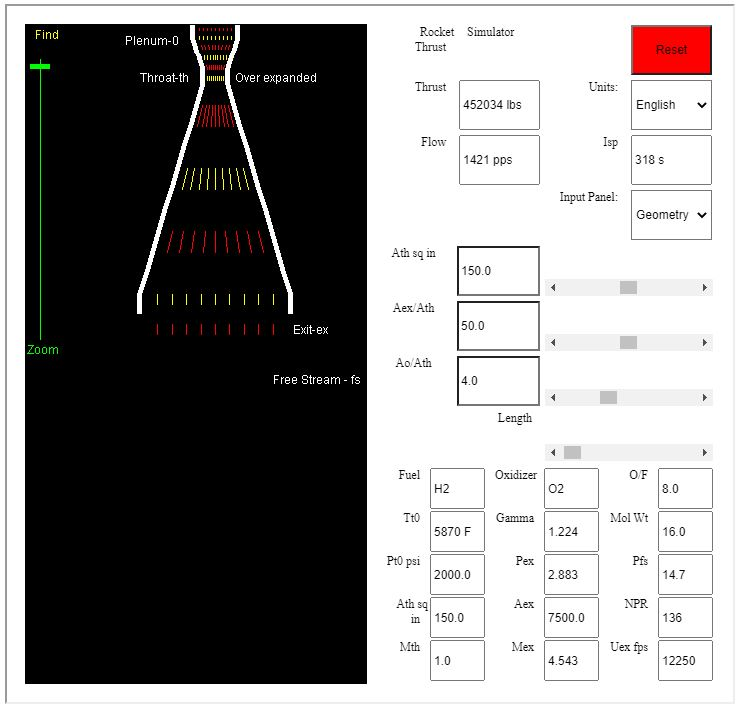

---
**Name**: RocketModeler  
**Applet**: RocketModeler.zip  
**Shortcode**: [bga_simulation name="RocketModeler"]  
**Example**: TBD  
**Status**: Phase 1 testing complete     
**Instructions**: [Rocket Modeler Wiki](https://gitlab.grc.nasa.gov/gwip/bga-applet-archive/-/wikis/RocketModeler-Interactive-Simulator-(RocketModeler-III))

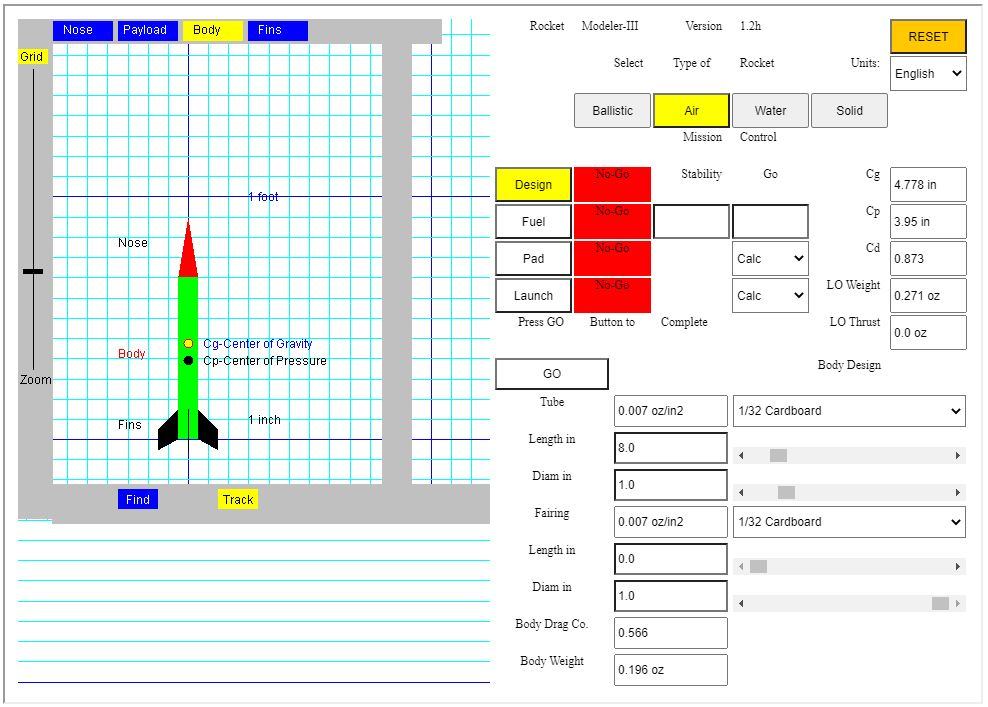

---
**Name**: Roll  
**Applet**: Roll.zip  
**Shortcode**: [bga_simulation name="Roll"]  
**Example**: TBD  
**Status**: Page Not Found

---
**Name**: Rud  
**Applet**: Rud.zip  
**Shortcode**: [bga_simulation name="Rud"]  
**Example**: TBD  
**Status**: Phase 1 testing complete    
**Instructions**: [Rudders Biplane Wiki](https://gitlab.grc.nasa.gov/gwip/bga-applet-archive/-/wikis/Rudders%20Interactive%20Biplane)

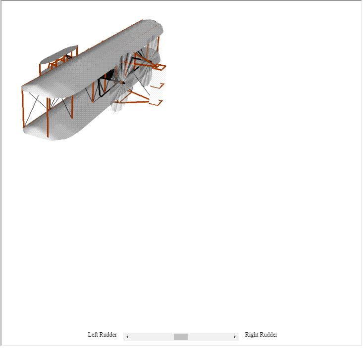

---
---
**Name**: Shape  
**Applet**: Shape.zip  
**Shortcode**: [bga_simulation name="Shape"]  
**Example**: TBD  
**Status**: Phase 1 testing complete

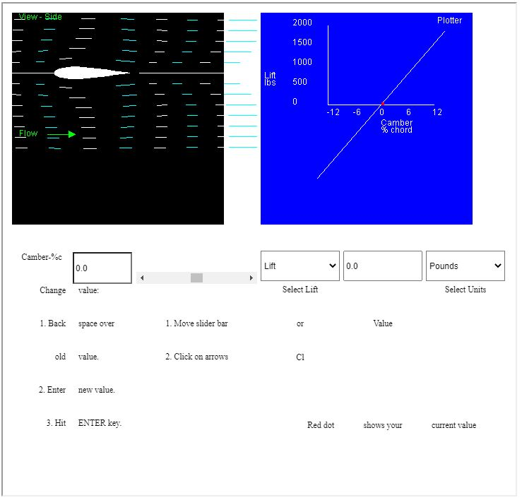

---
---
**Name**: Shock  
**Applet**: Shock.zip  
**Shortcode**: [bga_simulation name="Shock"]  
**Example**: TBD  
**Status**: Phase 1 testing complete     
**Instructions**: [Shock Wiki](https://gitlab.grc.nasa.gov/gwip/bga-applet-archive/-/wikis/Oblique%20Shocks%20Interactive)

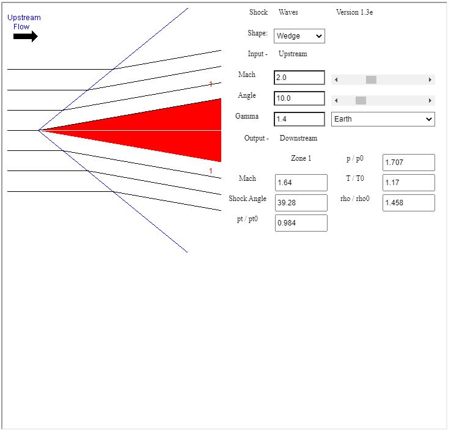

---
**Name**: Shockc  
**Applet**: Shockc.zip  
**Shortcode**: [bga_simulation name="Shockc"]  
**Example**: TBD  
**Status**: Phase 1 testing complete

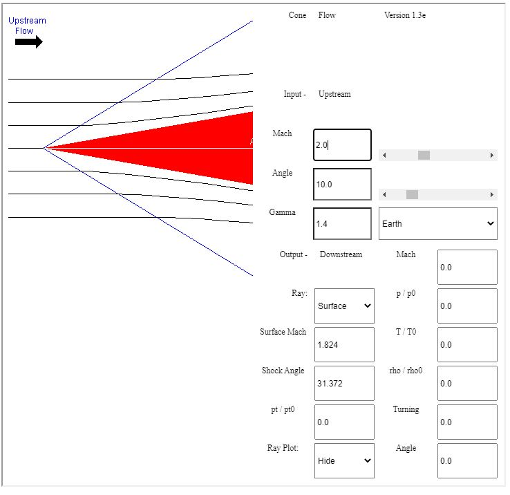

---
**Name**: Soccer  
**Applet**: Soccer.zip  
**Shortcode**: [bga_simulation name="Soccer"]  
**Example**: TBD  
**Status**: Phase 1 testing complete

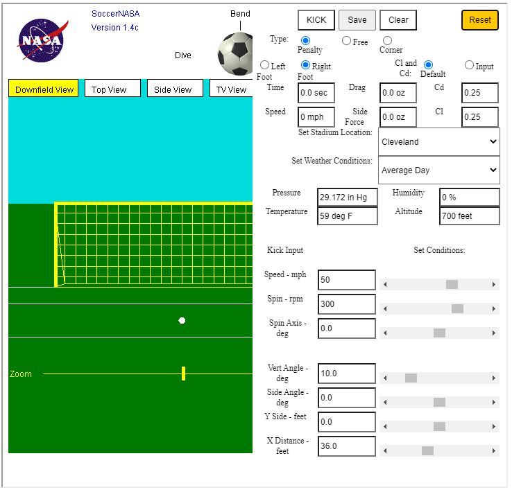

---
**Name**: Sound  
**Applet**: Sound.zip  
**Shortcode**: [bga_simulation name="Sound"]  
**Example**: TBD  
**Status**: Phase 1 testing complete

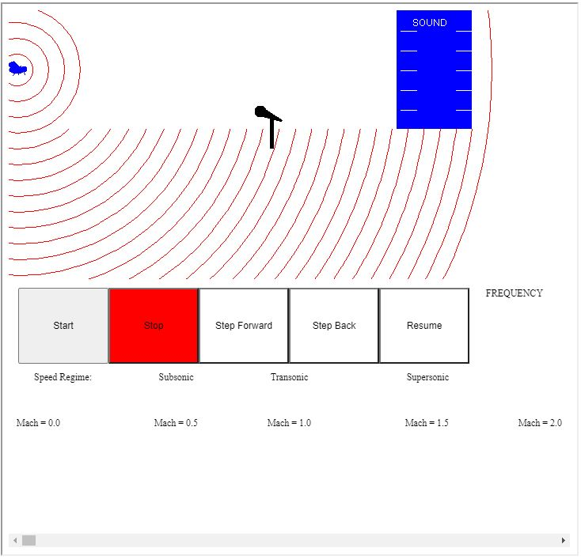

---
**Name**: SPCal  
**Applet**: SPCal.zip  
**Shortcode**: [bga_simulation name="SPCal"]  
**Example**: TBD  
**Status**: Phase 1 testing complete

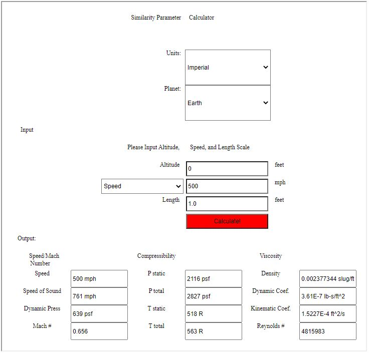

---

**Name**: Stablat  
**Applet**: Stablat.zip  
**Shortcode**: [bga_simulation name="Stablat"]  
**Example**: TBD  
**Status**: Phase 1 testing complete    
**Instructions**: [Stabilator Wiki](https://gitlab.grc.nasa.gov/gwip/bga-applet-archive/-/wikis/Stabilator%20Interactive%20Simulator)

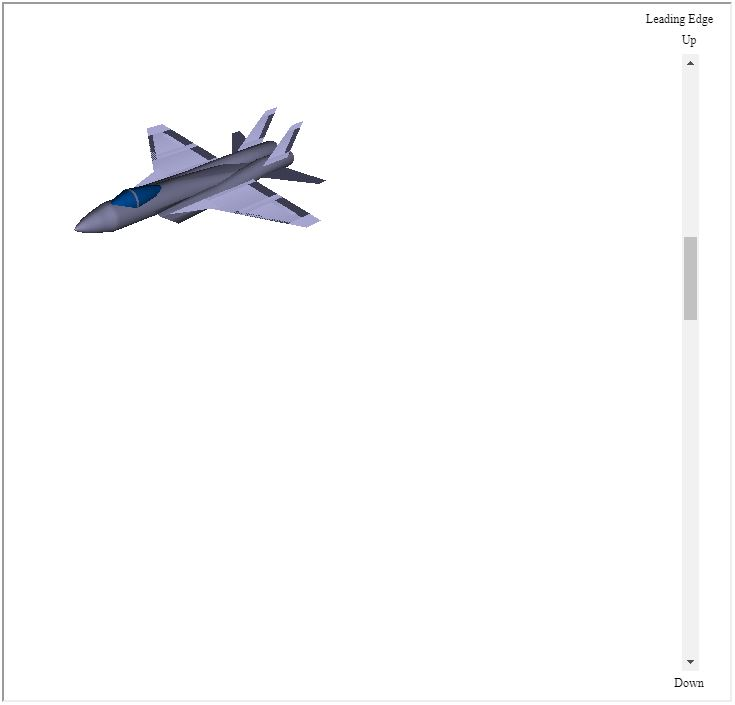

---
**Name**: Stage  
**Applet**: Stage.zip  
**Shortcode**: [bga_simulation name="Stage"]  
**Example**: TBD  
**Status**: Phase 1 testing complete

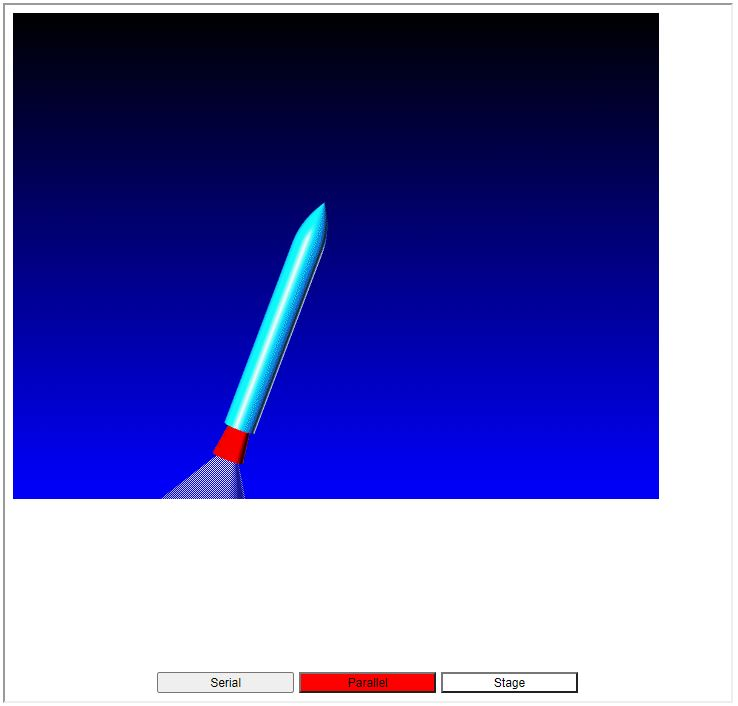

---
**Name**: Sys  
**Applet**: Sys.zip  
**Shortcode**: [bga_simulation name="Sys"]  
**Example**: TBD  
**Status**: Phase 1 testing complete

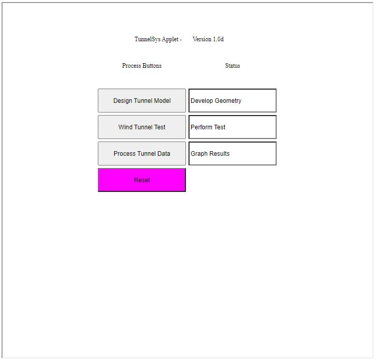

---
**Name**: TermVel  
**Applet**: TermVel.zip  
**Shortcode**: [bga_simulation name="TermVel"]  
**Example**: TBD  
**Status**: Phase 1 testing complete    
**Instructions**: [Terminal Velocity Wiki](https://gitlab.grc.nasa.gov/gwip/bga-applet-archive/-/wikis/Terminal%20Velocity%20Calculator)

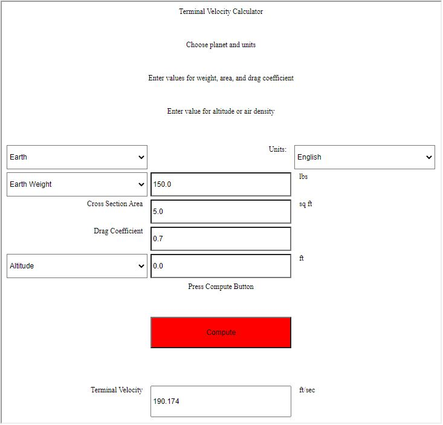

---
**Name**: Tunl  
**Applet**: Tunl.zip  
**Shortcode**: [bga_simulation name="Tunl"]  
**Example**: TBD  
**Status**: Phase 1 testing complete

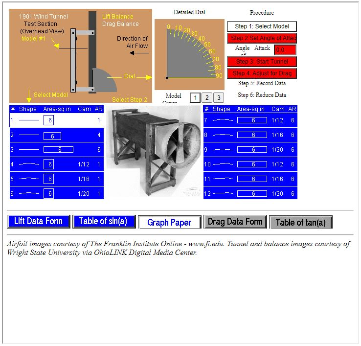

---
**Name**: Tunnel  
**Applet**: Tunnel.zip  
**Shortcode**: [bga_simulation name="Tunnel"]  
**Example**: TBD  
**Status**: Phase 1 testing complete

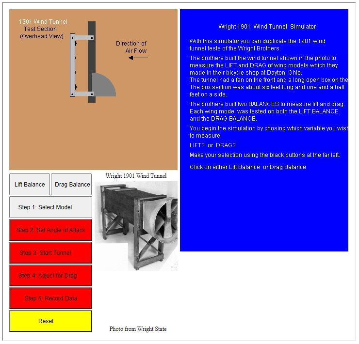

---
**Name**: Tuno  
**Applet**: Tuno.zip  
**Shortcode**: [bga_simulation name="Tuno"]  
**Example**: TBD  
**Status**: Phase 1 testing complete       
**Instructions**: [Return Wind Tunnel Wiki](https://gitlab.grc.nasa.gov/gwip/bga-applet-archive/-/wikis/Return%20Wind%20Tunnel%20Interactive)

---
**Name**: Velocity  
**Applet**: Velocity.zip  
**Shortcode**: [bga_simulation name="Velocity"]  
**Example**: TBD  
**Status**: Phase 1 testing complete

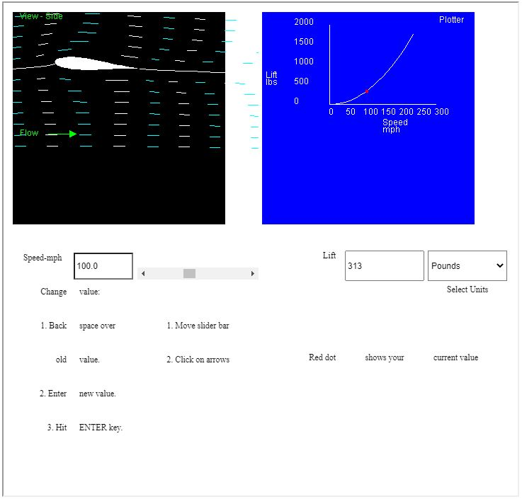

---
**Name**: Whit  
**Applet**: Whit.zip  
**Shortcode**: [bga_simulation name="Whit"]  
**Example**: TBD  
**Status**: Phase 1 testing complete     
**Instructions**: [Weather Effects on Hitting Wiki](https://gitlab.grc.nasa.gov/gwip/bga-applet-archive/-/wikis/Flight%20Trajectory)

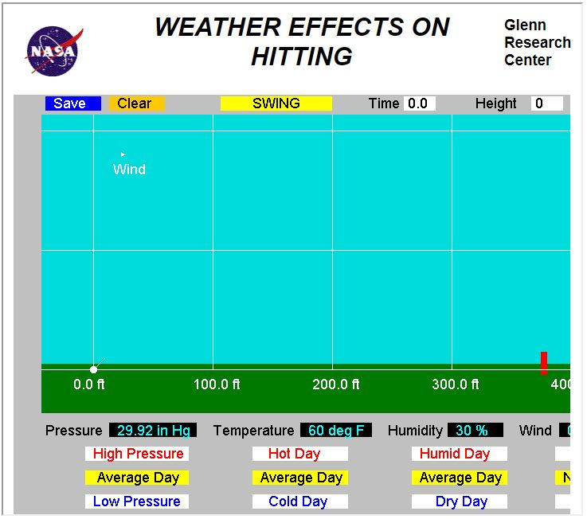

---
**Name**: Yaw  
**Applet**: Yaw.zip  
**Shortcode**: [bga_simulation name="Yaw"]  
**Example**: TBD  
**Status**: Phase 1 testing complete

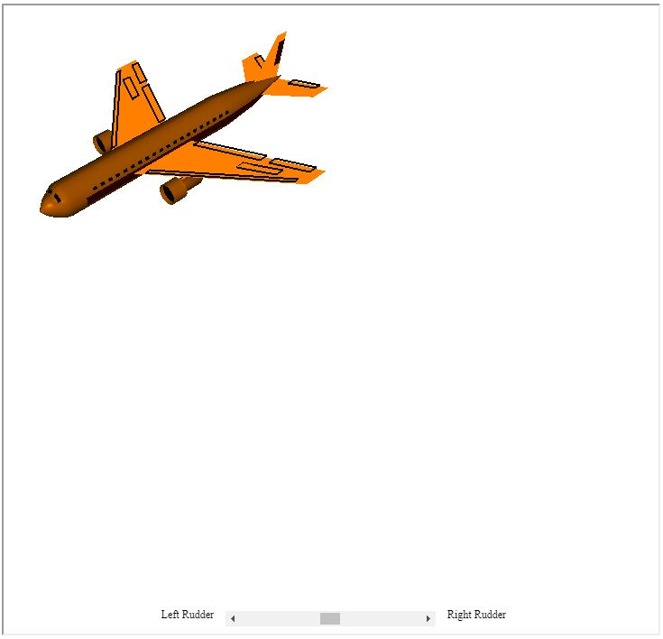

---
**Name**: Stomp  
**Applet**: Stomp.zip  
**Shortcode**: [bga_simulation name="Stomp"]  
**Example**: TBD  
**Status**: Phase 1 testing complete

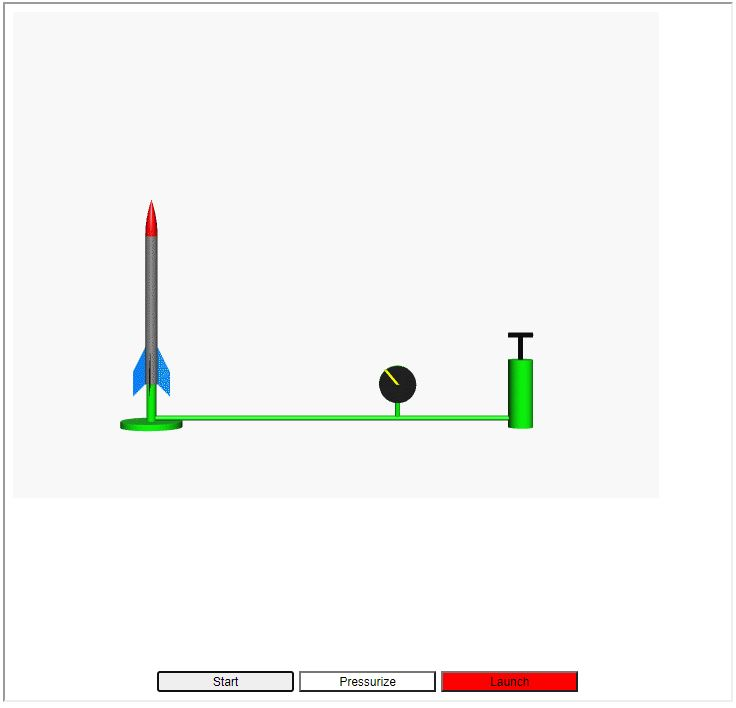

---
**Name**: Elv  
**Applet**: Elv.zip  
**Shortcode**: [bga_simulation name="Elv"]  
**Example**: TBD  
**Status**: Phase 1 testing complete

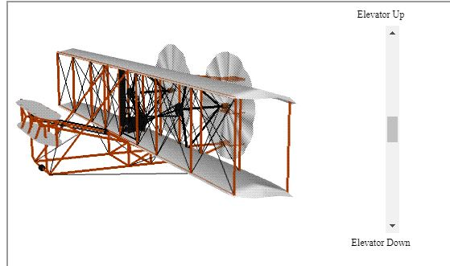

---
**Name**: Moc  
**Applet**: Moc.zip  
**Shortcode**: [bga_simulation name="Moc"]  
**Example**: TBD  
**Status**: Phase 1 testing complete

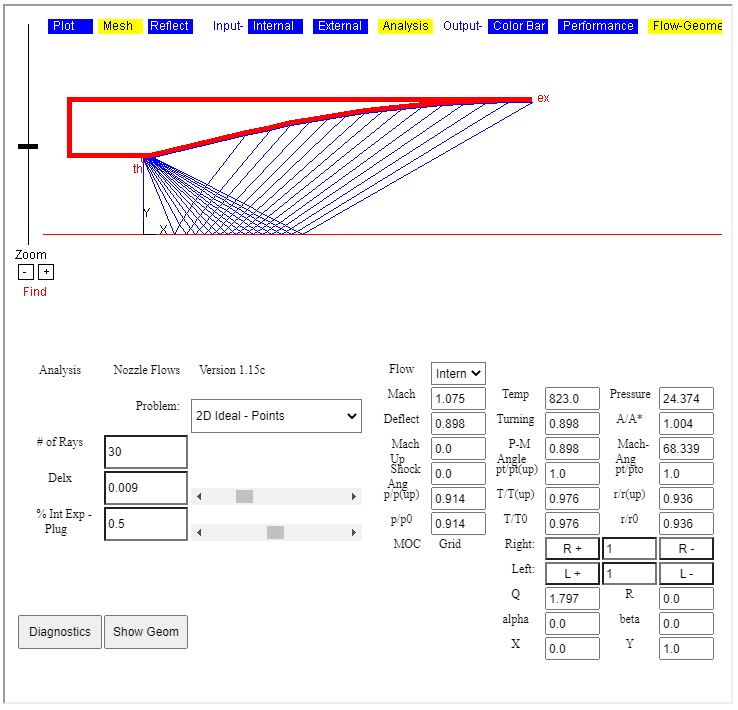

---
**Name**: Wtest  
**Applet**: Wtest.zip  
**Shortcode**: [bga_simulation name="Wtest"]  
**Example**: TBD  
**Status**: Page Not Found

